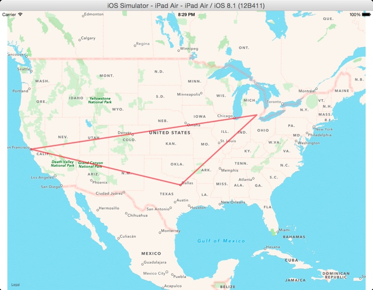

<h1>Adding a MKPolyLine overlay using Swift to an iOS MapKit Map</h1>

One of the features mobile users love is to see information conveyed right on a map surface. Weather, driving directions and customer locations are just more richly explained when superimposed on a map.

In this post I'll walk through the steps to draw a MKPolyLine on a MapKit map using the Swift programming language. PolyLines are useful in many scenarios:

<ul>
<li>Tracing driving or walking directions
Showing the outside edge of a political boundary (e.g. a city or state)  </li>
<li>Drawing a border around some other map annotation</li>
</ul>

The methodology for drawing PolyLines in recent versions of iOS has changed, so that the older MKOverlayView methodology is deprecated beginning with iOS 7, and the newer MKOverlayRenderer technique is now preferred (and when using Swift is required).

Let's look at the process by talking through a UIViewController class that draws a PolyLine overlay.  This class is very simple so that it just illustrates the technique with the most simple code possible to draw a static line over a default map.

<pre><code>import UIKit  
import MapKit

class SimplePolylineViewController:  
   UIViewController, MKMapViewDelegate {
</code></pre>

In Line 2 above we import the MapKit framework, and at the end of line 5 declare that our class conforms to the MKMapViewDelegate protocol.  This protocol is what ensures our viewForOverlay function will be called appropriately (defined later).  

<pre><code>@IBOutlet var map : MKMapView!

    override func viewDidLoad() {
        super.viewDidLoad()
        createTestPolyLine()
    }

    func createTestPolyLine(){
        var locations = [
        CLLocation(latitude: 32.7767, longitude: -96.7970),         /* San Francisco, CA */
        CLLocation(latitude: 37.7833, longitude: -122.4167),        /* Dallas, TX */
        CLLocation(latitude: 42.2814, longitude: -83.7483),         /* Ann Arbor, MI */
        CLLocation(latitude: 32.7767, longitude: -96.7970)          /* San Francisco, CA */
        ]

        addPolyLineToMap(locations)
    }
</code></pre>

Line 1 is the outlet that connects the class back to the MKMapView placed on the form using Interface Builder.

In viewDidLoad, we call a routine to create a test PolyLine.  The PolyLine can be created or removed at any time (it doesn't have to be in the viewDidLoad). In this example, I've simply added a PolyLine that draws a triangle between three US cities.

The createTestPolyLine routine defined on line 8 simply creates an array of CLLocation, and then passes that to the addPolyLineToMap function (defined below).  

<pre><code>func addPolyLineToMap(locations: [CLLocation!])  
    {
        var coordinates = locations.map({ (location: CLLocation!) -&gt; CLLocationCoordinate2D in
            return location.coordinate
        })

        var polyline = MKPolyline(coordinates: &amp;coordinates, count: locations.count)
        self.map.addOverlay(polyline)
    }
</code></pre>

This routine accepts an array of CLLocation, and uses the .map routine to iterate over the location array to generate the array of coordinates expected by MapKit's addOverlay function.

At this point we've done all the work we need to to add the PolyLine to the Map. But the Map still hasn't drawn our PolyLine (it just knows we want it). Later, when the Map is ready to display our line, it will callback the following routine, which will return a PolyLineRenderer. Since we've only added one object to the form, it will only be called once in this case.  

<pre><code>func mapView(mapView: MKMapView!, viewForOverlay overlay: MKOverlay!) -&gt; MKOverlayRenderer! {

        if (overlay is MKPolyline) {
            var pr = MKPolylineRenderer(overlay: overlay);
            pr.strokeColor = UIColor.redColor().colorWithAlphaComponent(0.5);
            pr.lineWidth = 5;
            return pr;
        }

        return nil
    }
</code></pre>

And that's it! At this point we've supplied everything we need to do in code to define and display a PolyLine on a MapKit map using Swift as the development language.

Here's what the program's output looks like:  

